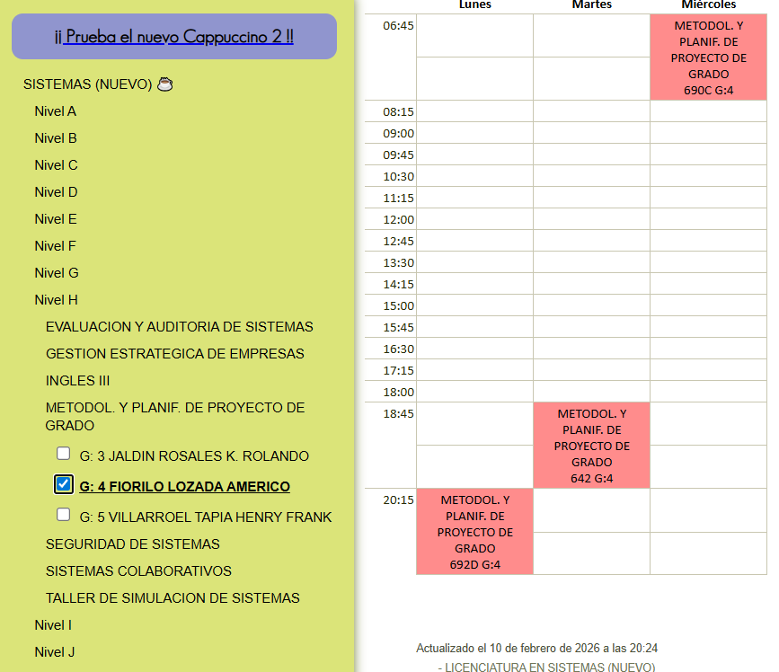

# Trabajo Individual

Name = Viraca Pacolla Joel Carlos
Celular = 64866872
Eimail = [joelviraca@gmail.com](mailto:joelviraca@gmail.com)

## Clase 1

### que es git?

Es un sistema de Control de Versiones Distribuido(CVS). permite guardar archivos y las versiones guardandolos del tiempo de manera local

### como nacio Git?

Linus Torvalds un colaborador externo cuando habia una colaboracion externa lo hacie mediante Email, para poner su codigo o no hacerlo de manera manual uno por uno es laborioso.

En contraste para en conjunto con su comunidad usando BitKeeper, la regla de los colaboradores de no usar otro codigo en otro repositorio, pero la regla no fue cumplida quitandole el acceso a linus Torvalds, creando asi Git

### como instalamos git?

Para su presente instalacion se hara lo siguiente :

#### En Windows

La forma más fácil:

Ve a la web oficial: https://git-scm.com/
Descarga el instalador
Ejecuta el .exe
Dale Next a todo (la configuración por defecto funciona bien)

Esto te instala:
Git

#### En macOS

Opción 1 (la más fácil)

Abre Terminal y escribe:

git --version

Si no lo tienes, macOS te pedirá instalarlo automáticamente.

#### En Linux

Ubuntu / Debian
sudo apt update
sudo apt install git

Fedora
sudo dnf install git

Arch Linux
sudo pacman -S git

### Comandos vistos

git config --global user.name "Joel carlos viraca pacolla" #crea nombre de usuario
git config --global user.email "joelviraca@gmail.com" #crea email para la creacion
git config --global --list #listado de todas lo creado
git init
git add README.md
git status
git commit

### Justificacion

No pude asistir a la clase 1 del dia lunes por que tenia choques en la materia, tengo dos clases los lunes y jueves a las 20:15, de la materia de peril, los lunes el inge da avanses para presentar por ese motivo fui a su materia, ademas que despues en la revision habia muchas personas por ende tarde en salir de la clase y ruteo lo cambio su horario del martes por jueves

### Evidencia Justificación

## Clase 2

### estados de Git

tenemor primero lo que son los estados de git

Directorio de Trabajo, Stage Area, Reporitorio local

El directorio de Trabajo se basa en crear modificar o eliminar ficheros si es necesario hacerlo, si quiere guardar prepara cambios.

Stage Area es el area de espera lo que se quiere guardar, confirmando loa cambios antes de subir un commit

Repositorio local es cuando tienes historial teniendo ya ID que ya forman parte de la historia de cambios

### Directorio de Trabajo modificado

Es una carpeta comun donde git cataloga en dos estados: Untracked, Modified

Untracked: que no tiene seguimiento esta siendo observado a traves de git status cuyo archivo no tiene una version antigua.

Modified: sucede cuando git ya cumple con una version antigua ya esta siendo registrado sabiendo cuando modificaste, eliminaste o cambiaste de nombre dicho archivo si antes de haber ejecutado .gitignore pasa automaticamente a uno de los dos estados

### comandos

git status: observa el estado del archivo ya sea modifocado o eliminado o creado

git restore Archivo modificado vuelva a su estado original

.gitignore: git no ve el archivo que creaste

git add : adrega el archivo este archivo agrega uno por uno

git add .: agrega todos los archivos que esten obsevados por git, este es un comando mas que todo utilizado en git para actualizar las ramas o archivos nuevos cuando trabajas en un git en escritorio

git restore --staged sacar un archivo stage area para volver al estado aterior

### Repositorio Local

git commit -m "mensaje" : se crea un commit para que el repositorio quesea creado garde todos los cambios que estan en staged y pasen a ser parte del historial

git reset --soft HEAD~1 : desacer el ultimo commit del comando

### Buenas Practicas

los commits son modifiacones pequenias mejoras haceidno cambios a codigo fuente, es mejor hacer commits pequenios que graban tu progreso con iteraciones pequenias

los commits deben de tener lo siguiente que contengan verbos usando palabras claves para su revision por ejemplo: verbos imperativos(add, change, Fix, Remove)

El uso de , o . a la hora de usar commits ya que cada caracter cuenta a la hora e escribir un cambio asi que es mejor no usarlo

### Escribir buenos commits

-usar como maximo 50 caracteres

-usar prefijos para los commits para hacerlos mas semanticos

=> git commit -m "feat:Add new search feature"

git push -u origin main

NOTA: PARA ESTO YA TIENES QUE HABER INICIALIZADO EL REPO LOCAL (git init) Y TENER UN COMMIT INICIAL AL MENOS (git add . + git commit -m “Initial commit”)

### Conexcion repositorio Local de git con uno en Github

git remote add origin git@github.com:TuUser/TuRepo.git

### Escribir buenos commits Prefijos

feat: para una nueva característica para el usuario.

fix: para un bug que afecta al usuario.

perf: para cambios que mejoran el rendimiento del sitio.

build: para cambios en el sistema de build, tareas de despliegue o instalación.

ci: para cambios en la integración continua.

### Crear un repositorio de GitHub

1: ver al apartado de perfil de ussuario en gitHub, buscar en Repositorios click en "New"

2: Poner el nombre al repositorio si tiene una descripcion mejor y luego click en “Create Repository”

docs: para cambios en la documentación.

refactor: para refactorización del código como cambios de nombre de variables o funciones.

ssh -T git@github.com

style: para cambios de formato, tabulaciones, espacios o puntos y coma, etc; no afectan al usuario.

test: para tests o refactorización de uno ya existente.

Si es necesario es mejor aniadir todo el contexto que sea necesario en el cuerpo del commit.

/Copias el contenido del anteroir comando y te diriges a github donde te diriges a tu perfil → Settings y luego SSH y GPG Keys y luego “New SSH Key” (1) y pegas tu key, le das un nombre para tu PC y click en “Add SSH Key”. (2)/

## Clase 3

### GitHub y Git

cat ~/.ssh/id_ed25519.pub

GitHub es una plataforma en la nube y red social para desarrolladores que permite alojar, gestionar y colaborar en proyectos de software

ssh-keygen -t ed25519 -C “tu-correo@email.com”

En la terminal colocamos el siguiente comando desde Windows:

### configuracion SSH

ssh-keygen -t ed25519 -C “tu-correo@email.com”

cat ~/.ssh/id_ed25519.pub

### Git vs GitHub

Git es el sistema de control de versiones que crea los "puntos de guardado", y GitHub es el servidor donde esos puntos se almacenan y se socializan con el mundo.

### HTTPS

Cuando clonamos y queremos usar un repositorio con HTTPS, este nos pedira autenticarnos cada vez, hasta pidiendonos un token.

Configuramos en nuestra PC/Laptop ssh para comunicarnos con github, mediante una key la cual al ponerla en Github no necesitara pedirnos autenticarnos cada vez.

###configuracion SSH

En la terminal colocamos el siguiente comando desde Windows: ssh-keygen -t ed25519 -C “tu-correo@email.com”

cat ~/.ssh/id_ed25519.pub

/Copias el contenido del anteroir comando y te diriges a github donde te diriges a tu perfil → Settings y luego SSH y GPG Keys y luego “New SSH Key” (1) y pegas tu key, le das un nombre para tu PC y click en “Add SSH Key”. (2)/

ssh -T git@github.com

###Crear un repositorio de GitHub

1: ver al apartado de perfil de ussuario en gitHub, buscar en Repositorios click en "New" 

2: Poner el nombre al repositorio si tiene una descripcion mejor y luego click en “Create Repository”

###Conexcion repositorio Local de git con uno en Github

git remote add origin git@github.com:TuUser/TuRepo.git git branch -M main

git push -u origin main

NOTA: PARA ESTO YA TIENES QUE HABER INICIALIZADO EL REPO LOCAL (git init) Y TENER UN COMMIT INICIAL AL MENOS (git add . + git commit -m “Initial commit”)

###clonar un repositorio de Git

Para ello haces el comando: 

git clone “git@github.com:TuUser/TuRepo.git”

git clone “https://github.com/TuUser/TuRepo.git” cuando clonas por https te pide autentificacion constantemente para cambiar de hhtps a SSH se usa: git remote set-url origin “git@github.com:TuUser/TuRepo.git”

la conexcion del repositorio remoto esta conectado a tu repo:

git remote -v

###comandos Subir y bajar cambios:

Subir mis cambios.: git push origin

Bajar los cambios hechos.: git pull origin

git branch -M main
